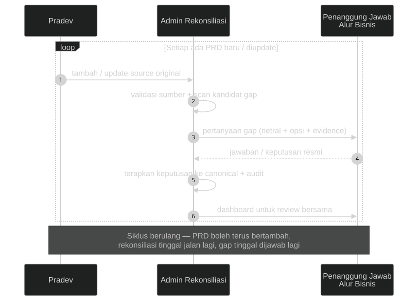

<!-- _class: title -->

# Rekonsiliasi PRD Neurovi

### Dari 200+ dokumen lintas versi → satu baseline kebenaran

**Progres, alur kerja, dan kesiapan canonical sebagai base PRD developer**

24 Agustus 2026

---

# Masalahnya

- Dokumen PRD hidup dalam **banyak representasi**: Versi A, Versi B, MERGED, draft lama (v2.1 vs v2.4)…
- Representasi-representasi itu **saling bertentangan** — dan tidak ada yang tercatat sebagai jawaban resmi.
- Developer yang membaca dua versi mendapat **dua requirement berbeda**.
- Pertanyaan terbuka tersebar di dalam dokumen, tanpa status, tanpa pemilik jawaban.

> Selama ini: konflik diselesaikan lewat chat & ingatan. Tidak ada audit trail.

---

# Contoh nyata (1 menit)

**Pendaftaran pasien baru — apa identitas yang wajib?**

| Versi | Aturan |
|---|---|
| Versi A | NIK 16 digit **wajib** |
| Versi B | Identitas Fleksibel — bayi baru lahir / WNA / tak dikenal **tanpa NIK tetap dilayani**, No. RM tetap terbit |
| MERGED | Mencatat konflik ini sebagai *"Pertanyaan Terbuka"* — **belum diputus** |

Dokumen MERGED sendiri mengakui 12 konflik A-vs-B yang belum diputus.

Kalau developer mulai besok — dia implementasi yang mana?

---

# Solusinya

Pipeline rekonsiliasi terkontrol dalam 2 repo:

| Repo | Isi |
|---|---|
| `neurovi-prd` | Dokumen: **source immutable**, canonical baseline, workspace rekonsiliasi, release |
| `neurovi-doc-reconciliator` | Tools: scanner, reconciler, audit report, dashboard |

Prinsip inti:

- **Mesin hanya memindai & mencatat** — keputusan requirement selalu di tangan manusia.
- **Dokumen asli tidak pernah disentuh** — terverifikasi byte-identical (SHA-256).
- **Setiap keputusan punya ID, opsi, rationale, dan evidence** — bisa diaudit ulang kapan pun.

---

# Alur kerja — siapa melakukan apa

**Siklus berulang:** PRD boleh terus bertambah/diupdate — rekonsiliasi tinggal jalan lagi, gap tinggal dijawab lagi.

<!-- sumber diagram: assets/human-workflow.mmd (mermaid sequenceDiagram) — edit .mmd lalu re-render dengan mmdc -->

---

# Di balik layar — pipeline teknis

<!-- sumber diagram: assets/pipeline.mmd (mermaid flowchart LR) — edit .mmd lalu re-render dengan mmdc -->

---

# Kenapa ini bisa dipercaya?

<!-- sumber diagram: assets/decision-gate.mmd (mermaid flowchart TD) — edit .mmd lalu re-render dengan mmdc -->

- Scanner **tidak pernah** memutuskan requirement — outputnya hanya *kandidat*.
- Gap yang belum terjawab **tidak hilang** — tetap tercatat terbuka sampai ada disposisi.
- Setiap closure dari fakta sumber diverifikasi manusia dengan **`path:line` persis**.

---

# Progres — angka nyata

| Skala | Angka |
|---|---|
| E2E dalam worklist | **23** |
| Dokumen canonical | **209** (semua payload byte-identical ke sumber) |
| Kandidat scanner total | **738** |
| **E2E-RJ (Rawat Jalan)** | ✅ **SELESAI — release v0.0.1** |
| ├ Sesi rekonsiliasi | 2 (MAIN_FLOW + BUSINESS_CASES) — keduanya `RECONCILED` |
| ├ Keputusan `USER_CONFIRMED` | **27** (`DEC-RJ-001` s.d. `DEC-RJ-027`) |
| ├ Konflik A-vs-B diputus | 12 (di dokumen MERGED) |
| ├ Register scanner E2E-RJ | 20 resolved · 28 excluded · **0 open** |
| └ Baseline approval | `DEC-GLOBAL-001` + annotated tag **`v0.0.1`** |

22 E2E lainnya terbawa utuh dari bootstrap `v0.0.0` — belum direkonsiliasi.

---

<!-- _class: demo -->

# DEMO

### Dashboard rekonsiliasi (live)

`index.html` → kartu **E2E-RJ** → `workspace-E2E-RJ.html`

Dibangkitkan read-only dari register — regenerasi kapan pun, selalu up-to-date.

---

# Anatomi satu keputusan

**`DEC-RJ-011`** — NIK wajib (A) vs Identitas Fleksibel (B)

| Elemen | Isi |
|---|---|
| Pertanyaan netral | NIK wajib 16 digit atau Identitas Fleksibel untuk pasien baru? |
| Opsi disajikan | Wajib NIK (A) · Identitas Fleksibel (B) · Simpan gap terbuka |
| Keputusan user | **Identitas Fleksibel (B)** |
| Rationale | Pasien tanpa NIK (bayi baru lahir, WNA, tak dikenal) tetap dapat dilayani, No. RM tetap terbit |
| Evidence | `prd-pendaftaran-rawat-jalan-merged.md` (Pertanyaan Terbuka) + `versi-gdoc.md` BR-B-03 |
| Status | `USER_CONFIRMED`, timestamped |

Semua 27 keputusan punya struktur lengkap yang sama → **dapat diaudit ulang per baris**.

---

# Canonical = base PRD untuk developer

Yang berubah di release **v0.0.1** — **9 dari 209 PRD canonical** (semua E2E-RJ):

| Kelas perubahan | Dokumen | Artinya untuk developer |
|---|---|---|
| `FORMAL_CHANGE` (3) | PRD-RJ-005 (Pendaftaran MERGED), PRD-RJ-010 (Asesmen), PRD-RJ-012 (D5) | Ada keputusan yang **mengubah requirement** — baca bagian *Confirmed Decisions* |
| `CONTEXT_ONLY` (4) | PRD-RJ-003, 007, 008, 011 | Keputusan hanya menetapkan **versi mana yang otoritatif** / konteks |
| `NONE` (2) | PRD-RJ-001, 002 | Tidak berubah; defect-nya dicatat terbuka |

Cara kerja aman-nya:

- **Payload sumber tetap byte-identical** — keputusan ditambahkan sebagai *appended section*, dokumen asli tidak disunting.
- Developer membaca **satu file canonical** = isi sumber otoritatif + keputusan resmi + gap yang masih terbuka.

---

# Contoh: PRD-RJ-005 setelah rekonsiliasi

12 konflik "Pertanyaan Terbuka" di dokumen MERGED kini punya jawaban resmi:

- Skrining gejala → **Batuk saja** (Strategi TEMPO)
- Identitas pasien baru → **Identitas Fleksibel**
- Piutang → **info-only, tidak memblokir pendaftaran**
- Wewenang hapus registrasi → **Kepala Pendaftaran**
- Target pencarian pasien → **≤ 2 detik** (DB ≤ 100rb)
- Diagnosa awal ICD-10 saat SEP → **wajib**
- Scope SATUSEHAT → **modul B1**
- Internet BPJS tidak stabil → **terima dulu, rekonsiliasi kemudian** (0 menit downtime loket)
- Biometrik BPJS → **tersedia, wajib di loket**
- Target pendaftaran pasien lama → **≤ 3 klik / ≤ 30 detik**
- Format No. RM → **6 digit auto increment** (`000001`, `000002`, …)
- Recall nomor order penunjang → **dropdown diadopsi**

---

# Yang sengaja dibiarkan terbuka

Rekonsiliasi yang jujur tidak menutup-nutupi gap. Arti tiap status:

| Status | Artinya |
|---|---|
| **Ditunda** | Disadari ada, tapi diputuskan bahas nanti |
| **Terbuka** | Belum ada jawaban resmi — tetap kelihatan sampai diputus |
| **Diterima apa adanya** | Gap diakui resmi sebagai kondisi saat ini, tidak perlu tindakan sekarang |
| **Review terpisah** | Sengaja dibatasi scope-nya, dibahas di sesi lain |

Yang tercatat di E2E-RJ:

| Item | Status | Artinya buat developer |
|---|---|---|
| `DEF-RJ-001` Barcode identitas APM | **Ditunda** | Jangan implementasi dulu — requirement belum final |
| `DEF-RJ-002` Trigger cetak D5 di dashboard B1 | **Terbuka** | Lokasi tombol cetak belum terdefinisi di spec B1 |
| `DEF-RJ-BC-001` Status "Dilayani (tutup)" vs "Selesai" | **Terbuka** | Pakai 4 status resmi state machine dulu |
| `DEF-RJ-BC-002` Scan KTP (perangkat TBD) | **Diterima apa adanya** | Resmi Phase 2 — di luar scope development sekarang |
| 5 relasi → PRD-RJ-008 (v2.1 superseded) | **Review terpisah** | Referensi silang yang belum dirapikan, bukan blocker |

**Tidak ada gap yang hilang diam-diam** — semua tetap terlihat di register & dashboard.

---

# Hasil yang diharapkan (definition of done)

Target akhir inisiatif ini:

1. **23/23 E2E** berstatus `RECONCILED` — E2E-RJ jadi cetak biru prosesnya.
2. **0 kandidat scanner tanpa disposisi** di seluruh register.
3. Setiap E2E punya release dengan `BASELINE_APPROVAL` + annotated git tag.
4. **Canonical jadi satu-satunya base PRD** yang dibaca developer — bukan dokumen mentah lintas versi.
5. Gap yang belum terjawab tetap terlihat, berstatus jelas, dan punya pemilik keputusan.

---

# Apakah hasilnya sudah memuaskan?

| Aspek | Nilai | Catatan |
|---|---|---|
| **Metode** | ✅ Terbukti end-to-end | Pipeline jalan dari scan → interview → approval → tag, dalam 1 hari untuk 1 E2E |
| **Kualitas** | ✅ Tinggi | 0 kandidat open di E2E-RJ; setiap keputusan ber-evidence; payload 209/209 byte-identical (termasuk perbaikan line-ending di baseline gate) |
| **Cakupan** | ⏳ **Baru 1/23 E2E** | Belum bisa klaim selesai — yang terbukti adalah metodenya |

**Kesimpulan jujur:** hasil E2E-RJ memuaskan dan siap jadi base PRD developer untuk Rawat Jalan. Tapi ini bukti kelayakan (*pilot*), bukan garis finis.

---

# Estimasi & roadmap

Data lapangan dari E2E-RJ (21 Agu 2026):

- **1 E2E ≈ 2 sesi ≈ 1 hari kerja** (27 keputusan, 48 baris register terdisposisi).
- Proyeksi kasar sisa **22 E2E ≈ 4–5 minggu kerja** (asumsi kompleksitas serupa; E2E besar seperti EMR/Billing bisa lebih lama).

Usulan prioritas berikutnya:

1. **E2E-RI (Rawat Inap)** — relasi lintas-domain dengan E2E-RJ sudah terverifikasi (SPRI, Transfer Internal, Discharge).
2. **E2E-IGD** — volume kunjungan tinggi.
3. Review terpisah: 5 relasi `REFERENCES` ke PRD-RJ-008 (`DEC-RJ-005`).

Langkah administratif: **push** repo `neurovi-prd` (branch `preserve-prd-line-endings` ahead 1, tag `v0.0.1` belum di remote).

---

# Ringkasan

- Masalah: PRD lintas versi tanpa jawaban resmi → **developer tidak punya base yang pasti**.
- Solusi: pipeline rekonsiliasi **human-in-the-loop** dengan audit trail penuh; dokumen asli tidak pernah berubah.
- Bukti: **E2E-RJ selesai dalam 1 hari** — 27 keputusan, 0 gap liar, release **v0.0.1** ter-approve & ter-tag.
- Canonical v0.0.1 **siap jadi base PRD developer** untuk Rawat Jalan.
- Jalan ke depan: replikasi proses ke 22 E2E sisanya (~4–5 minggu).

# Terima kasih — Q&A

---

<!-- _class: title -->

# Appendix Teknis

---

# Appendix A — Jaminan integritas sumber

- Setiap PRD canonical = **payload byte-identical** dari `source/original/` (LF, SHA-256 tercatat di `manifest.json`) + wrapper + appended decision sections.
- Nama file canonical: `KODE - judul singkat.md` (mis. `PRD-RJ-005 - Pendaftaran Rawat Jalan (MERGED).md`) — kode tetap primary key; **kamus kode ↔ judul**: `reconciliation/canonical/index.md`.
- Baseline gate menangkap & memperbaiki penyimpangan nyata: 9 PRD sempat ter-rewrite CRLF saat append → payload LF asli **di-re-embed**, verifikasi ulang **209/209 byte-identical**.
- `build_structure.py validate` dijalankan sebelum & sesudah sesi: **643/643 source preservation intact** (satu-satunya temuan: file `PRD_MASTER_DATA_KAMAR.docx` ter-rename — pre-existing, tidak terkait sesi).
- `git status` membuktikan tidak ada file di bawah `source/original/` yang termodifikasi.

---

# Appendix B — Skema register & determinisme

- `decision-register.csv`: decision_id, tipe (CONFLICT_RESOLUTION / GAP_RESOLUTION / GAP_CLOSURE), pertanyaan, opsi, keputusan, rationale, affected_documents, affected_traces, timestamps, status.
- `automatic-reconciliation.json`: register scanner per baris — status, evidence `path:line`, `requirement_change=NONE` pada closure otomatis; checksum manifest resync setiap perubahan.
- Closure otomatis **hanya** untuk fakta literal; 13 kandidat E2E-RJ ternyata *false positive* mekanis scanner — diverifikasi manusia per baris sebelum ditutup.
- Dashboard & audit report diregenerasi deterministik dari register (read-only); satu-satunya elemen non-deterministik adalah timestamp generate.

---

# Appendix C — Status git & administrasi

- Branch kerja: `preserve-prd-line-endings` — HEAD `fc9775b` *"feat: baseline E2E-RJ reconciliation release v0.0.1"* (ahead 1 dari origin).
- Annotated tag `v0.0.1` → merujuk `DEC-GLOBAL-001`.
- Remote: `https://gitlab.localtamtech.com/prio27/neurovi-prd.git` — **push belum dilakukan** (menunggu konfirmasi).
- Catatan changes.md: identitas author git di environment ini `fauzan@tamtech.id` — konfirmasi sebelum push.

---

<!--
=====================================================================
CARA RENDER / EXPORT (Marp)
=====================================================================
1. VS Code: install extension "Marp for VS Code" → buka file ini →
   Ctrl+Shift+P → "Marp: Export Slide As..." → HTML / PDF / PPTX.

2. CLI (tanpa install permanen, dari root repo tools):
   npx @marp-team/marp-cli -c docs/presentasi/marp.config.js --allow-local-files docs/presentasi/2026-08-24-rekonsiliasi-prd.md --html
   npx @marp-team/marp-cli -c docs/presentasi/marp.config.js --allow-local-files docs/presentasi/2026-08-24-rekonsiliasi-prd.md --pdf
   npx @marp-team/marp-cli -c docs/presentasi/marp.config.js --allow-local-files docs/presentasi/2026-08-24-rekonsiliasi-prd.md --pptx
   Catatan: --allow-local-files wajib agar SVG di assets/ ikut ter-render.
   Untuk PDF/PPTX tanpa Google Chrome, arahkan ke Edge dulu:
     $env:CHROME_PATH="C:\Program Files (x86)\Microsoft\Edge\Application\msedge.exe"

3. DIAGRAM: grafik alur adalah SVG hasil render mermaid (sumber .mmd di
   assets/). Kalau diagram perlu diedit:
     - edit assets/<nama>.mmd
     - render ulang (butuh Edge/Chrome, tanpa download Chromium):
         mmdc -p puppeteer-config.json -i assets/<nama>.mmd -o assets/<nama>.svg -b transparent -s 2
       contoh puppeteer-config.json:
         { "executablePath": "C:\\Program Files (x86)\\Microsoft\\Edge\\Application\\msedge.exe", "args": ["--no-sandbox"] }
     - export ulang deck seperti langkah 2.

CHECKLIST DEMO LIVE (Senin pagi, sebelum masuk ruangan):
[ ] Regenerate dashboard:
      python .codex/skills/neurovi-workspace-dashboard/scripts/workspace_dashboard.py --repo ../neurovi-prd
[ ] Buka 2 tab browser:
      .codex/skills/neurovi-workspace-dashboard/output/index.html
      .codex/skills/neurovi-workspace-dashboard/output/workspace-E2E-RJ.html
[ ] Fallback: slide 7-11 sudah memuat semua angka — presentasi tetap
    jalan tanpa demo.
=====================================================================
-->
